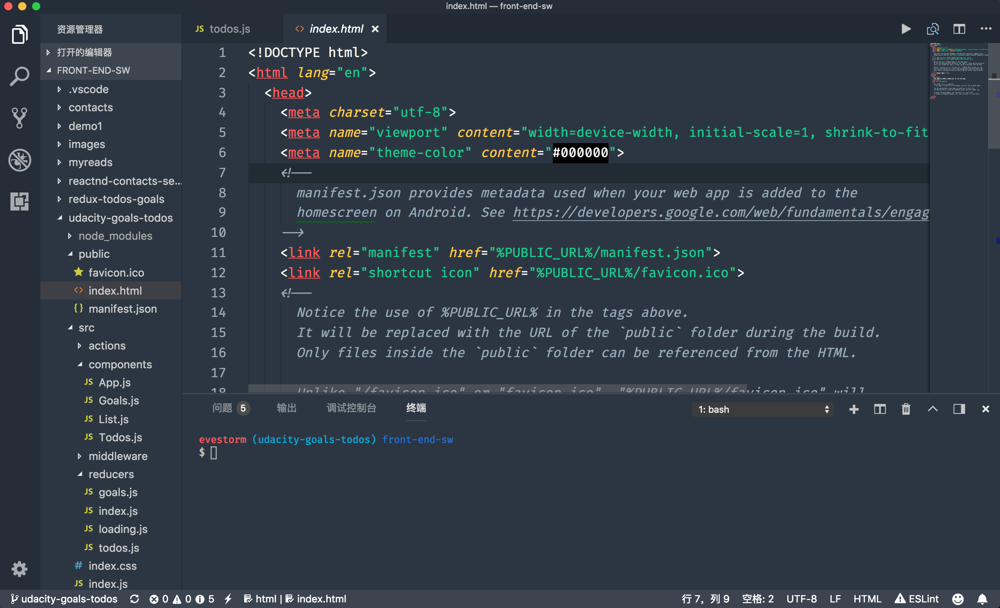

### 外观配置

- **主题**：[Chester Atom](https://marketplace.visualstudio.com/items?itemName=chriseckenrode.vscode-chester-atom)
- **图标**：[VSCode Great Icons](https://marketplace.visualstudio.com/items?itemName=emmanuelbeziat.vscode-great-icons)
- **字体**：[Fira Code](https://github.com/tonsky/FiraCode/wiki)

#### 预览

<!-- [](https://gitee.com/uploads/images/2018/0510/163001_02d3ddb2_1203301.png) -->



#### 用户设置（User Settings）

```json
{
    "editor.fontSize": 16,
    "workbench.colorTheme": "Chester Atom",
    "editor.fontFamily": "Fira Code",
    "emmet.triggerExpansionOnTab": true,
    "editor.fontLigatures": true
}
```

### 风格检查

- **[ESLint](https://marketplace.visualstudio.com/items?itemName=dbaeumer.vscode-eslint)**
- **[StyleLint](https://marketplace.visualstudio.com/items?itemName=shinnn.stylelint)**
- **[MarkdownLint](https://marketplace.visualstudio.com/items?itemName=DavidAnson.vscode-markdownlint)**
- **[Prettier](https://marketplace.visualstudio.com/items?itemName=esbenp.prettier-vscode)**

### 编码效率

#### 代码片段

- [HTML Snippets](https://marketplace.visualstudio.com/items?itemName=abusaidm.html-snippets)
- [Javascript (ES6) Code Snippets](https://marketplace.visualstudio.com/items?itemName=xabikos.JavaScriptSnippets)
- [Javascript Patterns Snippets](https://marketplace.visualstudio.com/items?itemName=nikhilkumar80.js-patterns-snippets)
- [Document This](https://marketplace.visualstudio.com/items?itemName=joelday.docthis)，一键给代码中的类、函数加上注释，支持函数声明、函数表达式、箭头函数等；

#### 自动补全

- [Auto Close Tag](https://link.juejin.im/?target=https%3A%2F%2Fmarketplace.visualstudio.com%2Fitems%3FitemName%3Dformulahendry.auto-close-tag)，在打开标签并且键入 `</` 的时候，能自动补全要闭合的标签；
- [Auto Rename Tag](https://link.juejin.im/?target=https%3A%2F%2Fmarketplace.visualstudio.com%2Fitems%3FitemName%3Dformulahendry.auto-rename-tag)，在修改标签名时，能在你修改开始（结束）标签的时候修改对应的结束（开始）标签。
- [Path Intellisense](https://link.juejin.im/?target=https%3A%2F%2Fmarketplace.visualstudio.com%2Fitems%3FitemName%3Dchristian-kohler.path-intellisense)，文件路径补全，在你用任何方式引入文件系统中的路径时提供智能提示和自动完成。
- [NPM Intellisense](https://link.juejin.im/?target=https%3A%2F%2Fmarketplace.visualstudio.com%2Fitems%3FitemName%3Dchristian-kohler.npm-intellisense)，NPM 依赖补全，在你引入任何 node_modules 里面的依赖包时提供智能提示和自动完成。
- [IntelliSense for CSS class names](https://link.juejin.im/?target=https%3A%2F%2Fmarketplace.visualstudio.com%2Fitems%3FitemName%3DZignd.html-css-class-completion)，CSS 类名补全，会自动扫描整个项目里面的 CSS 类名并在你输入类名时做智能提示。
- [Emmet](https://link.juejin.im/?target=https%3A%2F%2Femmet.io)，VSCode 已经内置，官方介绍文档[参见](https://link.juejin.im/?target=https%3A%2F%2Fcode.visualstudio.com%2Fdocs%2Feditor%2Femmet)。

#### 代码补全

- [Code Runner](https://marketplace.visualstudio.com/items?itemName=formulahendry.code-runner)
  <!-- [](https://user-gold-cdn.xitu.io/2018/4/14/162c15a64b468fd8?imageslim) -->
  

### 功能增强

- [Color Highlight](https://link.juejin.im/?target=https%3A%2F%2Fmarketplace.visualstudio.com%2Fitems%3FitemName%3Dnaumovs.color-highlight)，识别代码中的颜色，包括各种颜色格式。
- [Bracket Pair Colorizer](https://link.juejin.im/?target=https%3A%2F%2Fmarketplace.visualstudio.com%2Fitems%3FitemName%3DCoenraadS.bracket-pair-colorizer)，识别代码中的各种括号，并且标记上不同的颜色，方便你扫视到匹配的括号。
- [Settings Sync](https://marketplace.visualstudio.com/items?itemName=Shan.code-settings-sync)，基于 Gist 实现 VSCode 用户配置、快捷键配置、已安装插件列表等的备份和恢复功能，配置过程有详细精确的操作步骤文档。生成的备份 Gist 默认是私密的，如果你想设置为共享的，也可以一键切换。

### 外观增强

- [TODO Highlight](https://marketplace.visualstudio.com/items?itemName=wayou.vscode-todo-highlight)
  维护时间稍长的代码仓库免不了会有各种 TODO、FIXME、HACK 之类的标记，TODO Highlight 能够帮我们把这些关键词高亮出来，在你翻阅代码时非常醒目，就像是在大声提醒你尽快把他解决掉。支持自定义配置需要高亮的关键词，实际使用比较坑的地方是，TODO、FIXME 之类的后面必须加上冒号，否则无法高亮。
  <!-- [](https://user-gold-cdn.xitu.io/2018/4/14/162c1592cecf92d8?imageView2/0/w/1280/h/960/format/webp/ignore-error/1) -->
  