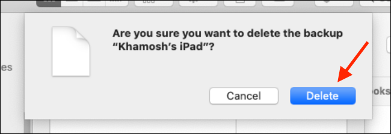

本地 iPhone 和 iPad 备份可能会占用大量空间。以下是查看正在使用多少空间并释放空间的方法。这些技巧适用于 macOS Catalina，macOS Mojave 和其他最新版本的 macOS。

从 Mac 删除 iPhone 和 iPad 备份之前，建议您将它们导出到外部驱动器。您可以使用 Time Machine 或简单地复制并粘贴备份文件夹。您也可以打开 iCloud 备份。删除备份之前，请确保已将其复制到其他位置，或者确保不再需要它。

<!-- more -->

## 从存储管理中删除备份

macOS Mojave 引入了一个新的存储管理工具，该工具列出了 iOS 备份。以前，您必须导航到特定的 Finder 文件夹才能查看 Mac 上的所有 iOS 备份文件。

要访问它，请单击菜单栏中的“ Apple”图标，然后选择“关于本机”选项。



在这里，切换到“存储”选项卡，然后单击“管理”按钮。



在“存储管理”窗口中，单击侧栏中的“ iOS 文件”选项。

现在，您将在此处看到所有 iOS 文件备份。右键单击要删除的 iOS 备份，然后单击“删除”选项。



再次单击“删除”按钮以确认您的选择。



现在，iOS 备份将被删除，您将获得存储空间。重复此过程以删除其他备份。

**PC 或 Mac 上我的 iPhone 或 iPad 备份在哪里？**

## 从 Finder 删除 iPhone 和 iPad 备份

从 macOS Catalina 开始，Apple 将 iTunes 应用程序拆分为多个应用程序-音乐，播客和电视。现在，Finder 负责同步 iPhone 和 iPad。

如果习惯于从 iTunes 管理设备备份，则可以从 Finder 应用程序执行相同的步骤。

首先，将 iPhone 或 iPad 连接到 Mac，打开 Finder 应用程序，然后从侧栏中选择设备。在这里，单击“管理备份”按钮。



现在，弹出窗口将列出 Mac 上的所有 iPhone 和 iPad 备份。选择要删除的备份，然后单击“删除备份”按钮。



在弹出窗口中，通过单击“删除”按钮确认您的步骤。

[在 Finder 弹出窗口中单击“删除”按钮](https://evestorm.github.io/posts/21365/在Finder弹出窗口中单击“删除”按钮.png)

iOS 备份现在将被删除。您可以对要删除的所有备份执行此操作。

**如何在没有 iTunes 的情况下备份和还原 iPhone 或 iPad**

## 在 Finder 中查找所有 iPhone 和 iPad 备份

如果您没有运行 macOS Mojave，或者只想手动删除文件和文件夹，则可以从 Finder 应用程序中删除。

所有 iPhone 和 iPad 备份都存储在“库”文件夹中的一个特定子文件夹中。

您可以使用 Spotlight 搜索快速到达那里。单击菜单栏上的“搜索”图标或按 Command + Space 将其打开，粘贴以下文本，然后按 Enter。

```shell
~/Library/Application Support/MobileSync/Backup/
```



Finder 将立即打开，您将看到 iOS 备份的所有文件夹。唯一的问题是文件夹名称不可读。您将不知道与备份关联的 iOS 设备。但是，您可以使用时间戳记来计算备份的时间。

如果要从 Mac 删除所有 iOS 备份，这是最快的方法。

您可以选择要删除的备份（文件夹），单击鼠标右键，然后选择“移至垃圾箱”选项将其删除。



要释放 Mac 上的存储空间，请右键单击“垃圾箱”图标，然后选择“空垃圾箱”。


