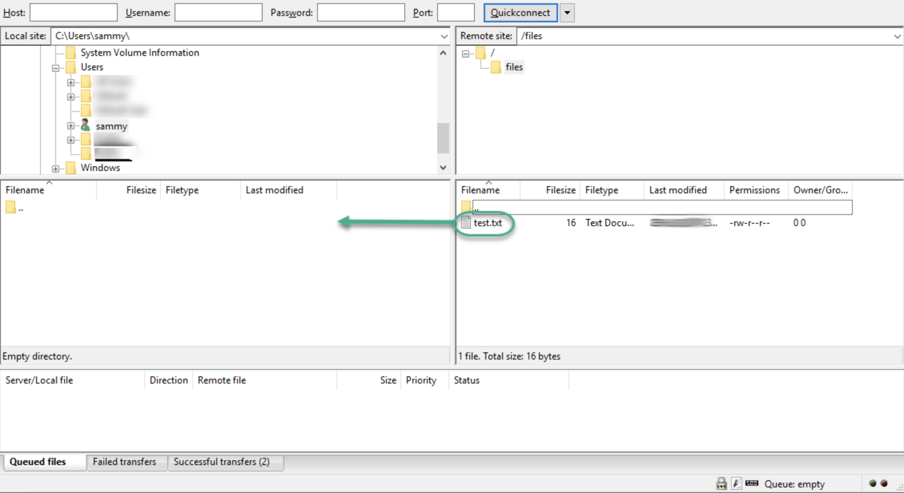

## 购买

进入阿里云下拉菜单选择 ecs ：



我购买的配置如下：



购买后实例就运行了，远程连接后安装一系列包和软件：

## 如何安装

[阿里云服务器 ECS LAMP 环境安装（Ubuntu）](https://www.cnblogs.com/87hbteo/p/7802104.html)
[阿里云 ECS 云服务器外网 IP 无法访问](https://blog.csdn.net/KascLiyuan/article/details/73438093)

## 域名解析

[阿里云如何解析域名](https://jingyan.baidu.com/article/48b558e3f25e6d7f38c09aec.html)

## Github Page 自定义域名

- [创建 Github Page 并设置自定义域名](https://www.jianshu.com/p/8ac6c7c037c5)
- [添加 CNAME 文件到你的存储库中](http://wiki.jikexueyuan.com/project/github-pages-basics/cname-file.html)

## Ubuntu 安装 nodejs

- [https://blog.5udou.cn/blog/A-Li-Yun-UbuntuDa-Jian-NodeJsHuan-Jing-75](https://evestorm.github.io/posts/58410/阿里云Ubuntu搭建NodeJs环境)

## ubuntu 图形界面下无法用 root 登录解决办法

先按照 [这个教程](https://www.linuxidc.com/Linux/2017-01/139094.htm) 走，但最后不重启。然后转到 [这个教程](https://blog.csdn.net/qq_39591507/article/details/81288644)，执行第三步，也就是下面这段：

> 进入/etc/pam.d 文件夹下，修改 gdm-autologin 和 gdm-passwd 文件内容(首先修改文件权限，参考步骤 2 的操作)
>
> gdm-autologin 文件注释掉 auth required pam_success_if.so user!=root quiet_success 这一行
>
> gdm-passwd 文件注释掉 auth required pam_success_if.so user!=root quiet_success 这一行

做完后重启然后点击登录其他用户，输入 root 和密码 root（这个密码在上面第一个教程中已经自己设置了）就好。

## 安装 LAMP 环境

[在 ubuntu16.04 中一键创建 LAMP 环境](https://blog.csdn.net/qq_27366789/article/details/81990291)

### 编辑文件

- 退出 mysql 命令行：`exit`
- vi 编辑文件 按下 i 表示编辑 按下 esc 退出编辑模式 按下 `:wq` 保存退出

### mysql 操作

登录 mysql -u root -p

-u 表示选择登陆的用户名， -p 表示登陆的用户密码，现在是 mysql 数据库是没有密码的，Enter password:处直接回车，就能够进入 mysql 数据库。

#### 导入导出

[ubuntu 下 mysql 数据库的导入导出](https://blog.csdn.net/hewenjing8168/article/details/80821447)

## 安装 图形化 mysql-workbench

[安装 mysql 服务，及安装图形化管理界面](https://blog.csdn.net/qq_37638061/article/details/80246799)

## 打开 mysql 图形化后无法连接数据库

[Unbuntu 下 Mysql 连接 MysqlWorkBench 出现错误](https://blog.csdn.net/chexiansheng/article/details/89193955)

## 在 ubuntu 下搭建 ftp 服务器

- [如何在 Ubuntu 18.04 上为用户目录设置 vsftpd](https://www.howtoing.com/how-to-set-up-vsftpd-for-a-user-s-directory-on-ubuntu-18-04)
  执行完上面操作后，会发现下面两个问题，按方法调整就好：
- [使用 FileZilla FTP 下载时提示“不安全的服务器，不支持 FTPover TLS”,和“服务器不支持非 ASCII 字符”](https://blog.51cto.com/zhkao/1758125)
- [ftp 连接错误——服务器发回了不可路由的地址。使用服务器地址代替。](https://blog.csdn.net/wbryfl/article/details/82729189)

### 介绍

FTP 是文件传输协议的缩写，是一种曾经广泛用于在客户端和服务器之间移动文件的网络协议。 它已被更快，更安全，更方便的文件传输方式所取代。 许多休闲互联网用户希望通过`https`直接从他们的网络浏览器下载，命令行用户更有可能使用安全协议，如`scp`或[SFTP](https://www.howtoing.com/how-to-use-sftp-to-securely-transfer-files-with-a-remote-server/) 。

FTP 仍然用于支持具有特定需求的遗留应用程序和工作流。 如果您可以选择使用哪种协议，请考虑探索更现代的选项。 但是，当您确实需要 FTP 时，vsftpd 是一个很好的选择。 vsftpd 针对安全性，性能和稳定性进行了优化，可以很好地防范其他 FTP 服务器中存在的许多安全问题，并且是许多 Linux 发行版的默认设置。

在本教程中，您将配置 vsftpd 以允许用户使用具有 SSL / TLS 保护的登录凭据的 FTP 将文件上载到其主目录。

### 先决条件

要学习本教程，您需要：

- **Ubuntu 18.04 服务器和具有 sudo 权限的非 root 用户** ：您可以在[使用 Ubuntu 18.04](https://www.howtoing.com/initial-server-setup-with-ubuntu-18-04/)指南的[初始服务器设置中](https://www.howtoing.com/initial-server-setup-with-ubuntu-18-04/)了解有关如何使用这些权限设置用户的更多信息。

### 第 1 步 - 安装 vsftpd

让我们首先更新我们的包列表并安装`vsftpd`守护进程：

```shell
sudo apt update
sudo apt install vsftpd
```

安装完成后，让我们复制配置文件，这样我们就可以从空白配置开始，将原件保存为备份：

```shell
sudo cp /etc/vsftpd.conf /etc/vsftpd.conf.orig
```

通过备份配置，我们已准备好配置防火墙。

### 第 2 步 - 打开防火墙

**注意：** 最后我们还得打开 80 和 8080 端口！！！

让我们检查防火墙状态以查看它是否已启用。 如果是，我们将确保允许 FTP 流量，因此防火墙规则不会阻止我们的测试。

检查防火墙状态：

```shell
sudo ufw status
```

在这种情况下，只允许 SSH 通过：

```shell
OutputStatus: active

To                         Action      From
--                         ------      ----
OpenSSH                    ALLOW       Anywhere
OpenSSH (v6)               ALLOW       Anywhere (v6)
```

您可能有其他规则或根本没有防火墙规则。 由于在这种情况下只允许 SSH 流量，因此我们需要为 FTP 流量添加规则。

让我们打开端口`20`和`21`用于 FTP，端口`990`用于启用 TLS，端口`40000-50000`用于我们计划在配置文件中设置的被动端口范围：

```shell
sudo ufw allow 20/tcp
sudo ufw allow 21/tcp
sudo ufw allow 990/tcp
sudo ufw allow 40000:50000/tcp
sudo ufw status
```

我们的防火墙规则现在应如下所示：

```shell
OutputStatus: active

To                         Action      From
--                         ------      ----
OpenSSH                    ALLOW       Anywhere
990/tcp                    ALLOW       Anywhere
20/tcp                     ALLOW       Anywhere
21/tcp                     ALLOW       Anywhere
40000:50000/tcp            ALLOW       Anywhere
OpenSSH (v6)               ALLOW       Anywhere (v6)
20/tcp (v6)                ALLOW       Anywhere (v6)
21/tcp (v6)                ALLOW       Anywhere (v6)
990/tcp (v6)               ALLOW       Anywhere (v6)
40000:50000/tcp (v6)       ALLOW       Anywhere (v6)
```

p.s. 如何删除一个 rule：`sudo ufw delete allow 80/tcp`

安装了`vsftpd`并打开了必要的端口后，我们继续创建一个专用的 FTP 用户。

### 第 3 步 - 准备用户目录

我们将创建一个专用的 FTP 用户，但您可能已经有一个需要 FTP 访问的用户。 我们将注意保留现有用户对以下说明中的数据的访问权限。 即便如此，我们建议您在配置和测试设置之前先与新用户联系。

首先，添加一个测试用户：

```shell
sudo adduser sammy
```

出现提示时分配密码。 随意通过其他提示按`ENTER` 。

当用户被限制在特定目录时，FTP 通常更安全。 `vsftpd`用[`chroot`](https://www.howtoing.com/how-to-configure-chroot-environments-for-testing-on-an-ubuntu-12-04-vps/#what-is-a-chroot-environment) jails 完成了这个。 为本地用户启用`chroot` ，默认情况下它们仅限于其主目录。 但是，由于`vsftpd`保护目录的方式，用户不能写入。 这对于只应通过 FTP 连接的新用户来说很好，但如果现有用户也具有 shell 访问权限，则可能需要写入其主文件夹。

在这个例子中，不是从主目录中删除写权限，而是创建一个`ftp`目录作为`chroot`和一个可写`files`目录来保存实际文件。

创建`ftp`文件夹：

```shell
sudo mkdir /home/sammy/ftp
```

设置所有权：

```shell
sudo chown nobody:nogroup /home/sammy/ftp
```

删除写权限：

```shell
sudo chmod a-w /home/sammy/ftp
```

验证权限：

```shell
sudo ls -la /home/sammy/ftp
Outputtotal 8
4 dr-xr-xr-x  2 nobody nogroup 4096 Aug 24 21:29 .
4 drwxr-xr-x  3 sammy  sammy   4096 Aug 24 21:29 ..
```

接下来，让我们创建文件上传目录并为用户分配所有权：

```shell
sudo mkdir /home/sammy/ftp/files
sudo chown sammy:sammy /home/sammy/ftp/files
```

对`ftp`目录的权限检查应返回以下内容：

```shell
sudo ls -la /home/sammy/ftp
Outputtotal 12
dr-xr-xr-x 3 nobody nogroup 4096 Aug 26 14:01 .
drwxr-xr-x 3 sammy  sammy   4096 Aug 26 13:59 ..
drwxr-xr-x 2 sammy  sammy   4096 Aug 26 14:01 files
```

最后，让我们添加一个`test.txt`文件，以便在测试时使用：

```shell
echo "vsftpd test file" | sudo tee /home/sammy/ftp/files/test.txt
```

现在我们已经保护了`ftp`目录并允许用户访问`files`目录，让我们修改我们的配置。

### 第 4 步 - 配置 FTP 访问

我们计划允许具有本地 shell 帐户的单个用户与 FTP 连接。 这两个关键设置已在`vsftpd.conf`设置。 首先打开配置文件，验证配置中的设置是否与以下设置相匹配：

```shell
sudo nano /etc/vsftpd.conf
```

/etc/vsftpd.conf 文件

```shell
. . .
# Allow anonymous FTP? (Disabled by default).
anonymous_enable=NO
#
# Uncomment this to allow local users to log in.
local_enable=YES
. . .
```

接下来，让我们通过取消注释`write_enable`设置来允许用户上传文件：

/etc/vsftpd.conf 文件

```shell
. . .
write_enable=YES
. . .
```

我们还将取消注释`chroot`以防止 FTP 连接的用户访问目录树之外的任何文件或命令：

/etc/vsftpd.conf 文件

```shell
. . .
chroot_local_user=YES
. . .
```

我们还添加一个`user_sub_token`以在`local_root directory`路径中插入用户名，这样我们的配置将适用于此用户和任何其他未来用户。 在文件中的任何位置添加这些设置：

/etc/vsftpd.conf 文件

```shell
. . .
user_sub_token=$USER
local_root=/home/$USER/ftp
```

我们还限制了可用于被动 FTP 的端口范围，以确保有足够的连接可用：

/etc/vsftpd.conf 文件

```shell
. . .
pasv_min_port=40000
pasv_max_port=50000
```

**注意：**在第 2 步中，我们打开了我们在此处为被动端口范围设置的端口。 如果更改值，请务必更新防火墙设置。

要根据具体情况允许 FTP 访问，让我们设置配置，以便用户只有在明确添加到列表时才能访问，而不是默认情况下：

/etc/vsftpd.conf 文件

```shell
. . .
userlist_enable=YES
userlist_file=/etc/vsftpd.userlist
userlist_deny=NO
```

`userlist_deny`切换逻辑：当它设置为`YES` ，列表中的用户被拒绝 FTP 访问。 当它设置为`NO` ，只允许列表中的用户访问。

完成更改后，保存文件并退出编辑器。

最后，让我们将用户添加到`/etc/vsftpd.userlist` 。 使用`-a`标志追加到文件：

```shell
echo "sammy" | sudo tee -a /etc/vsftpd.userlist
```

检查它是否按预期添加：

```shell
cat /etc/vsftpd.userlist
Outputsammy
```

重新启动守护程序以加载配置更改：

```shell
sudo systemctl restart vsftpd
```

配置到位后，我们继续测试 FTP 访问。

### 第 5 步 - 测试 FTP 访问

我们已将服务器配置为仅允许用户`sammy`通过 FTP 连接。 让我们确保它按预期工作。

**匿名用户应该无法连接** ：我们已禁用匿名访问。 让我们通过尝试匿名连接来测试它。 如果我们的配置设置正确，则应拒绝匿名用户的权限。 请务必将`203.0.113.0`替换为服务器的公共 IP 地址：

```shell
ftp -p 203.0.113.0
OutputConnected to 203.0.113.0.
220 (vsFTPd 3.0.3)
Name (203.0.113.0:default): anonymous
530 Permission denied.
ftp: Login failed.
ftp>
```

关闭连接：

```shell
bye
```

**除了 sammy 之外的用户应该无法连接** ：接下来，让我们尝试连接我们的 sudo 用户。 他们也应该被拒绝访问，并且应该在他们被允许输入密码之前发生：

```shell
ftp -p 203.0.113.0
OutputConnected to 203.0.113.0.
220 (vsFTPd 3.0.3)
Name (203.0.113.0:default): sudo_user
530 Permission denied.
ftp: Login failed.
ftp>
```

关闭连接：

```shell
bye
```

**用户 sammy 应该能够连接，读取和写入文件** ：让我们确保我们的指定用户可以连接：

```shell
ftp -p 203.0.113.0
OutputConnected to 203.0.113.0.
220 (vsFTPd 3.0.3)
Name (203.0.113.0:default): sammy
331 Please specify the password.
Password: your_user's_password
230 Login successful.
Remote system type is UNIX.
Using binary mode to transfer files.
ftp>
```

让我们切换到`files`目录并使用`get`命令将我们之前创建的测试文件传输到本地机器：

```shell
cd files
get test.txt
Output227 Entering Passive Mode (203,0,113,0,169,12).
150 Opening BINARY mode data connection for test.txt (16 bytes).
226 Transfer complete.
16 bytes received in 0.0101 seconds (1588 bytes/s)
ftp>
```

接下来，让我们使用新名称上传文件以测试写入权限：

```shell
put test.txt upload.txt
Output227 Entering Passive Mode (203,0,113,0,164,71).
150 Ok to send data.
226 Transfer complete.
16 bytes sent in 0.000894 seconds (17897 bytes/s)
```

关闭连接：

```shell
bye
```

现在我们已经测试了我们的配置，让我们采取措施进一步保护我们的服务器。

### 第 6 步 - 保护交易

由于 FTP 不会加密传输中的任何数据，包括用户凭据，因此我们将启用 TLS / SSL 来提供加密。 第一步是创建用于`vsftpd`的 SSL 证书。

让我们使用`openssl`创建一个新证书，并使用`-days`标志使其有效一年。 在同一个命令中，我们将添加一个私有的 2048 位 RSA 密钥。 通过将`-keyout`和`-out`标志都设置为相同的值，私钥和证书将位于同一文件中：

```shell
sudo openssl req -x509 -nodes -days 365 -newkey rsa:2048 -keyout /etc/ssl/private/vsftpd.pem -out /etc/ssl/private/vsftpd.pem
```

系统将提示您提供证书的地址信息。 将您自己的信息替换为以下突出显示的值：

```shell
OutputGenerating a 2048 bit RSA private key
............................................................................+++
...........+++
writing new private key to '/etc/ssl/private/vsftpd.pem'
-----
You are about to be asked to enter information that will be incorporated
into your certificate request.
What you are about to enter is what is called a Distinguished Name or a DN.
There are quite a few fields but you can leave some blank
For some fields there will be a default value,
If you enter '.', the field will be left blank.
-----
Country Name (2 letter code) [AU]:US
State or Province Name (full name) [Some-State]:NY
Locality Name (eg, city) []:New York City
Organization Name (eg, company) [Internet Widgits Pty Ltd]:DigitalOcean
Organizational Unit Name (eg, section) []:
Common Name (e.g. server FQDN or YOUR name) []: your_server_ip
Email Address []:
```

有关证书标志的更多详细信息，请参阅[OpenSSL Essentials：使用 SSL 证书，私钥和 CSR](https://www.howtoing.com/openssl-essentials-working-with-ssl-certificates-private-keys-and-csrs/)

创建证书后，再次打开`vsftpd`配置文件：

```shell
sudo nano /etc/vsftpd.conf
```

在文件的底部，您将看到以`rsa_`开头的两行。 评论它们，看起来像这样：

/etc/vsftpd.conf 文件

```shell
. . .
# rsa_cert_file=/etc/ssl/certs/ssl-cert-snakeoil.pem
# rsa_private_key_file=/etc/ssl/private/ssl-cert-snakeoil.key
. . .
```

在它们下面，添加以下指向我们刚刚创建的证书和私钥的行：

/etc/vsftpd.conf 文件

```shell
. . .
rsa_cert_file=/etc/ssl/private/vsftpd.pem
rsa_private_key_file=/etc/ssl/private/vsftpd.pem
. . .
```

之后，我们将强制使用 SSL，这将阻止无法处理 TLS 的客户端连接。 这对于确保所有流量都已加密是必要的，但它可能会强制您的 FTP 用户更改客户端。 将`ssl_enable`更改为`YES` ：

/etc/vsftpd.conf 文件

```shell
. . .
ssl_enable=YES
. . .
```

之后，添加以下行以显式拒绝 SSL 上的匿名连接，并要求 SSL 进行数据传输和登录：

/etc/vsftpd.conf 文件

```shell
. . .
allow_anon_ssl=NO
force_local_data_ssl=YES
force_local_logins_ssl=YES
. . .
```

在此之后，通过添加以下行将服务器配置为使用 TLS（SSL 的首选后继者）：

/etc/vsftpd.conf 文件

```shell
. . .
ssl_tlsv1=YES
ssl_sslv2=NO
ssl_sslv3=NO
. . .
```

最后，我们将添加两个选项。 首先，我们不会要求重用 SSL，因为它可能会破坏许多 FTP 客户端。 我们将需要“高”加密密码套件，目前这意味着密钥长度等于或大于 128 位：

/etc/vsftpd.conf 文件

```shell
. . .
require_ssl_reuse=NO
ssl_ciphers=HIGH
. . .
```

完成的文件部分应如下所示：

/etc/vsftpd.conf 文件

```shell
# This option specifies the location of the RSA certificate to use for SSL
# encrypted connections.
#rsa_cert_file=/etc/ssl/certs/ssl-cert-snakeoil.pem
#rsa_private_key_file=/etc/ssl/private/ssl-cert-snakeoil.key
rsa_cert_file=/etc/ssl/private/vsftpd.pem
rsa_private_key_file=/etc/ssl/private/vsftpd.pem
ssl_enable=YES
allow_anon_ssl=NO
force_local_data_ssl=YES
force_local_logins_ssl=YES
ssl_tlsv1=YES
ssl_sslv2=NO
ssl_sslv3=NO
```

完成后，保存并关闭文件。

重新启动服务器以使更改生效：

```shell
sudo systemctl restart vsftpd
```

此时，我们将无法再使用不安全的命令行客户端进行连接。 如果我们尝试过，我们会看到类似的东西：

```shell
ftp -p 203.0.113.0
Connected to 203.0.113.0.
220 (vsFTPd 3.0.3)
Name (203.0.113.0:default): sammy
530 Non-anonymous sessions must use encryption.
ftp: Login failed.
421 Service not available, remote server has closed connection
ftp>
```

接下来，让我们验证我们是否可以使用支持 TLS 的客户端进行连接。

### 第 7 步 - 使用 FileZilla 测试 TLS

大多数现代 FTP 客户端都可以配置为使用 TLS 加密。 我们将演示如何与[FileZilla](https://filezilla-project.org/)连接，因为它支持跨平台。 请参阅其他客户的文档。

首次打开 FileZilla 时，在主页上方找到站点管理器图标，这是最上一行最左侧的图标。 点击它：



将打开一个新窗口。 单击右下角的“ **新建站点”**按钮：



在“ **我的网站”**下，将出现一个带有“ **新网站** ”字样的新图标。 您可以立即命名或稍后返回并使用“ **重命名”**按钮。

使用名称或 IP 地址填写**主机**字段。 在“ **加密”**下拉菜单下，选择“ **要求显式 FTP over TLS”** 。

对于**登录类型** ，选择**询问密码** 。 在“ **用户”**字段中填写您的 FTP 用户：



单击界面底部的“连接”。 系统将要求您输入用户密码：



单击**确定**以进行连接。 您现在应该使用 TLS / SSL 加密与您的服务器连接。

成功后，您将看到一个如下所示的服务器证书：



当您接受证书后，双击`files`夹并将`upload.txt`拖到左侧以确认您能够下载文件：

[](https://www.howtoing.com/wp-content/uploads/articles/vsftpd_18_04/vsftpd_images/filezilla_file_test_vsftpd_18_04.png)


完成后，右键单击本地副本，将其重命名为`upload-tls.txt`并将其拖回服务器以确认您可以上传文件：



您现在已确认可以安全地成功传输启用了 SSL / TLS 的文件。

### 第 8 步 - 禁用 Shell 访问（可选）

如果由于客户端要求而无法使用 TLS，则可以通过禁用 FTP 用户以任何其他方式登录的方式来获得一些安全性。 防止它的一种相对简单的方法是创建一个自定义 shell。 这不会提供任何加密，但会限制受感染帐户对 FTP 可访问的文件的访问。

首先，在`bin`目录中打开一个名为`ftponly`的文件：

```shell
sudo nano /bin/ftponly
```

添加一条消息，告诉用户他们无法登录的原因：

/斌/ ftponly

```shell
#!/bin/sh
echo "This account is limited to FTP access only."
```

保存文件并退出编辑器。

更改权限以使文件可执行：

```shell
sudo chmod a+x /bin/ftponly
```

打开有效 shell 列表：

```shell
sudo nano /etc/shells
```

在底部添加：

/ etc / shells 中

```shell
. . .
/bin/ftponly
```

使用以下命令更新用户的 shell：

```shell
sudo usermod sammy -s /bin/ftponly
```

现在尝试以`sammy`身份登录您的服务器：

```shell
ssh sammy@your_server_ip
```

你应该看到类似的东西：

```shell
OutputThis account is limited to FTP access only.
Connection to 203.0.113.0 closed.
```

这确认用户不能再`ssh`到服务器并且仅限于 FTP 访问。

### 结论

在本教程中，我们介绍了为具有本地帐户的用户设置 FTP。 如果您需要使用外部身份验证源，您可能需要了解`vsftpd`对虚拟用户的支持。 这通过使用 PAM（可插入身份验证模块）提供了丰富的选项，如果您管理其他系统（如 LDAP 或 Kerberos）中的用户，这是一个不错的选择。

### 执行完上面操作后的问题解决

#### 使用 FileZilla FTP 下载时提示“不安全的服务器，不支持 FTPover TLS”,和“服务器不支持非 ASCII 字符”

1、提示“不安全的服务器，不支持 FTPover TLS

解决方法：在站点管理器中，加密方式选择：



2、提示“服务器不支持非 ASCII 字符”

解决方法：在站点管理器中字符集选择：自定义字符集：GBK



OK,正常了

#### ftp 连接错误——服务器发回了不可路由的地址。使用服务器地址代替。

设置 filezilla 客户端的连接参数

1. 选中某一连接项
2. 高级——加密——只使用普通 ftp
3. 传输设置——传输模式——主动
4. 重新连接

## ubuntu 下 Apache 虚拟站点配置

https://www.linuxidc.com/Linux/2017-05/143590.htm

## apache 配置二级域名

[apache2 服务器 mod_rewrite 模块 开启方法[linux, ubuntu\]](https://www.cnblogs.com/wwufengg/articles/apache2-mod_rewrite.html)

开启重写，p.s. 上面教程中说要把 `/etc/apache2/sites-enabled/000-default` 中的 `AllowOverride None 修改为： AllowOverride All` ，然而我的 Apache2 是新版（2.4），所以得转到 `/etc/apache2/` 。将名为 `apache2.conf` 的文件中的 [下面代码从 NONE 改为 ALL](http://www.kbase101.com/question/9571.html) ：

```xml
<Directory /var/www/>
    Options Indexes FollowSymLinks
    AllowOverride All
    Require all granted
</Directory>
```

目标二级域名：mall.evelance.cn

阿里云控制台配置：在阿里云的控制台中找到域名管理，然后选择顶级域名 evelance.cn 后面的“解析”字样。在新打开的页面中我们可以看到一个提供域名解析的界面，选择解析类型为 A 类解析，然后输入 mall（我们想要的二级域名的头），然后在地址里面输入我们刚才查看到的 ECS 的公网 ip，然后点击确认，之后我们的解析就会生效了。

ubuntu 服务器配置：

进入 /etc/apache2/site-available/ ，复制默认的虚拟主机配置文件：

```shell
sudo cp 000-default.conf mall.evelance.cn.conf
```

修改配置：

```xml
<VirtualHost *:80>
    ServerAdmin xxx@qq.com
    ServerName mall.evelance.com
    DocumentRoot /home/www/mall

    <Directory "/home/www/mall">
        Options FollowSymLinks
        AllowOverride All
        #Require all denied
        Require all granted
    </Directory>

    ErrorLog ${APACHE_LOG_DIR}/error.log
    CustomLog ${APACHE_LOG_DIR}/access.log combined

</VirtualHost>
```

在 sites-enabled 目录下建立符号链接：

```shell
cd /etc/apache2/sites-enabled
#建立对应的软链接
sudo ln -s /etc/apache2/sites-available/mall.evelance.cn.conf /etc/apache2/sites-enabled/mall.evelance.cn.conf
```

在对应目录放入项目代码：

把项目文件放进 /home/www/mall 中，并赋予文件夹权限：

```shell
sudo chmod -R 777 /home/www/mall
```

激活配置，重启 apache：

返回上级目录 `cd ../site-enable/`，输入 `cd sites-available/`

输入 `a2ensite mall.evelance.cn.conf` ，如果提示已经激活过了，输入下面代码：

```shell
a2dissite mall.evelance.cn.conf
service apache2 reload
a2ensite mall.evelance.cn.conf
service apache2 reload
```

参考：

- [ECS 简单配置多个二级域名](https://blog.csdn.net/carolcoral/article/details/77857264)

### 域名解析

登录阿里云，进入控制台，选择云解析 DNS。选择右侧的解析管理，进行二级域名的添加：

- 记录类型：A
- 主机记录：[mall].evelance.cn
- 解析线路：默认
- 记录值：你的公共 IP
- TTL：10 分钟

参考：[阿里云添加二级域名的操作](https://blog.csdn.net/wangjia55/article/details/81127647)

### 支持 https

1. [在阿里云里申请免费 Https 证书 SSL](https://www.cnblogs.com/lxf1117/p/6650647.html)
2. [ubuntu apache2 配置安装 ssl 证书](https://yq.aliyun.com/articles/697838)
3. [阿里云 Ubuntu16.04 apache2 ssl 证书下载与安装（必须有域名）](https://www.cnblogs.com/wpl-php/p/10287125.html)
4. 完成上述配置后，别忘了让防火墙允许 443 端口。`sudo ufw allow 443/tcp`
